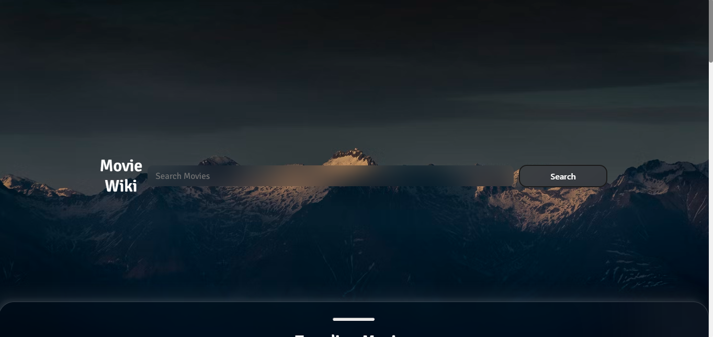
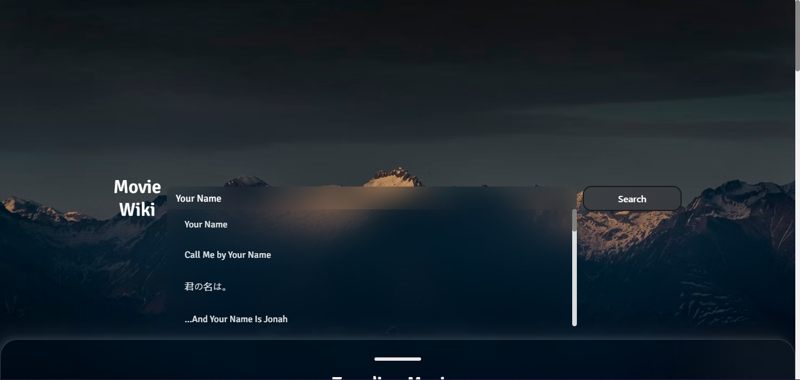
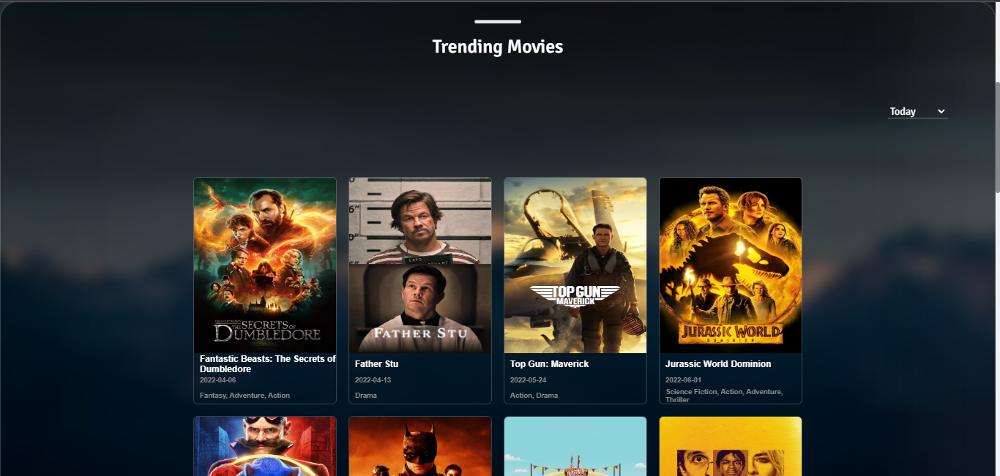
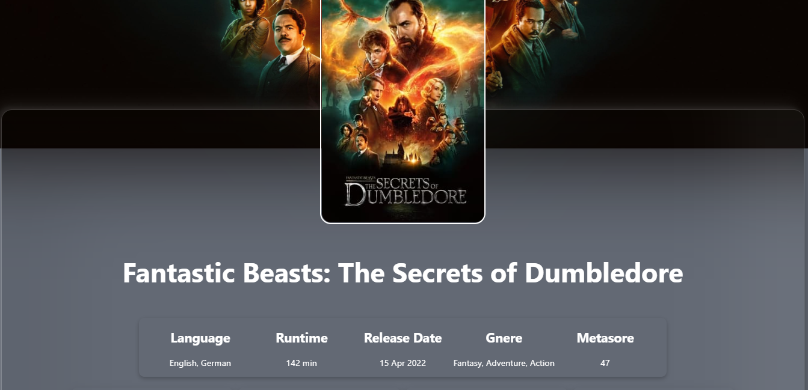

# Movie_Wiki

Movie_Wiki is a website about movie info you can get some info on your favourite movie or find some movies by you can do that here.
This is one my side projects. In this project I tried to explore CSS more and Javascript and found some realy interesting things 
that I applyed in this project and I learned alot from it. In the future I like to try more different things in my project and explore more.

here is the link to checkout the site - [click here](https://deluxe-biscochitos-466513.netlify.app).

## Tech Stack
- themoviedb Api
- Javascript
- CSS 
- HTML

## Features

- Optimised search functionality
- Trending Movie page with sorting functionality
- Individual Movie page
- Random recipe functionality

## Screenshots

 

 

 

## Conclusions
- I had so much fun building this website that I want to build some more. Even though I had to scrifice some of my free time to build it
  and during that time I had so many difficulties but i am so happy with it and I am so glad that I stuck through it and made to the end.

